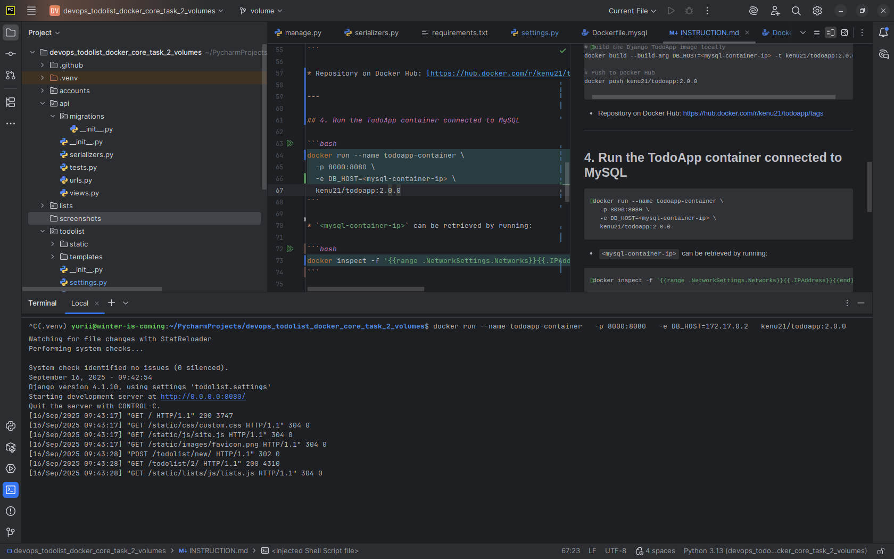

# INSTRUCTION.md

## Overview

This project contains two Dockerized components:

1. A **MySQL database** container based on the official MySQL image.
2. A **Django TodoApp** container that connects to the MySQL database.

Follow the steps below to build, run, and access the application.

---

## 0. Prerequisites

Add this line to your requirements.txt file:
requirements.txt

mysql-connector-python==8.2.0

This package is required because Django cannot use mysql.connector.django without it. Without it, the TodoApp will fail to connect to the MySQL database.


## 1. Build and Push MySQL image to Docker Hub

```bash
# Build the MySQL image locally
docker build -t kenu21/mysql-local:1.0.0 -f Dockerfile.mysql .

# Push to Docker Hub
docker push kenu21/mysql-local:1.0.0
```

* Repository on Docker Hub: [https://hub.docker.com/r/kenu21/mysql-local/tags](https://hub.docker.com/r/kenu21/mysql-local/tags)

---

## 2. Run MySQL container with a volume attached

```bash
docker run -d \
  --name mysql-local-container \
  -e MYSQL_DATABASE=app_db \
  -e MYSQL_USER=app_user \
  -e MYSQL_PASSWORD=1234 \
  -e MYSQL_ROOT_PASSWORD=root \
  -v mysql_data:/var/lib/mysql \
  -p 3306:3306 \
  kenu21/mysql-local:1.0.0
```

* `mysql_data` is a named Docker volume used to persist the database.
* The container exposes MySQL on port **3306**.

---

## 3. Build and Push TodoApp image to Docker Hub

```bash
# Build the Django TodoApp image locally
docker build --build-arg DB_HOST=<mysql-container-ip> -t kenu21/todoapp:2.0.0 .

# Push to Docker Hub
docker push kenu21/todoapp:2.0.0
```

* Repository on Docker Hub: [https://hub.docker.com/r/kenu21/todoapp/tags](https://hub.docker.com/r/kenu21/todoapp/tags)

---

## 4. Run the TodoApp container connected to MySQL

```bash
docker run --name todoapp-container \
  -p 8000:8080 \
  -e DB_HOST=<mysql-container-ip> \
  kenu21/todoapp:2.0.0
```

* `<mysql-container-ip>` can be retrieved by running:

```bash
docker inspect -f '{{range .NetworkSettings.Networks}}{{.IPAddress}}{{end}}' mysql-local-container
```

---

## 5. Access the Application

Once both containers are running:

* Open your browser and go to:
  👉 [http://localhost:8000](http://localhost:8000)

* You should see the **Django Todolist App** landing page.

---

## 6. Summary of Commands

```bash
# Build & push MySQL image
docker build -t kenu21/mysql-local:1.0.0 -f Dockerfile.mysql .
docker push kenu21/mysql-local:1.0.0

# Run MySQL container
docker run -d --name mysql-local-container \
  -e MYSQL_DATABASE=app_db \
  -e MYSQL_USER=app_user \
  -e MYSQL_PASSWORD=1234 \
  -e MYSQL_ROOT_PASSWORD=root \
  -v mysql_data:/var/lib/mysql \
  -p 3306:3306 \
  kenu21/mysql-local:1.0.0

# Build & push TodoApp image
docker build --build-arg DB_HOST=<mysql-container-ip> -t kenu21/todoapp:2.0.0 .
docker push kenu21/todoapp:2.0.0

# Run TodoApp container
docker run --name todoapp-container \
  -p 8000:8080 \
  -e DB_HOST=<mysql-container-ip> \
  kenu21/todoapp:2.0.0
```

## 7. Screenshot

Here is how the application looks when running:


